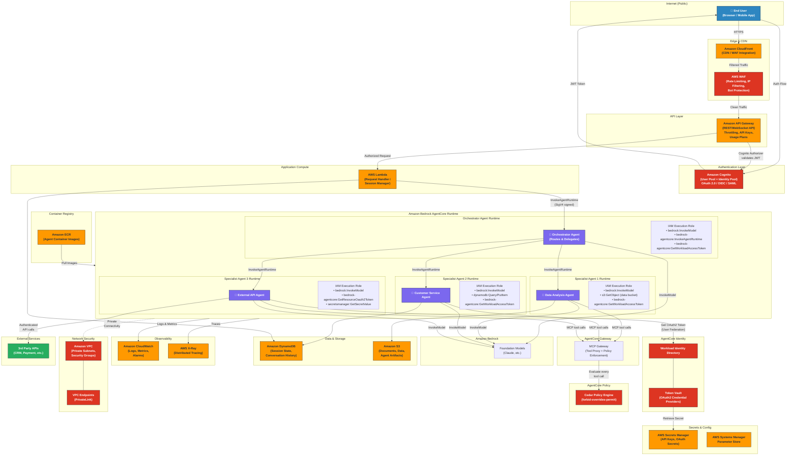

# Public-Facing Multi-Agent AgentCore Architecture



## Request Flow (numbered)

```
1. User authenticates via Amazon Cognito (OAuth 2.0 / OIDC)
2. User sends request → CloudFront → WAF (bot/DDoS filtering) → API Gateway
3. API Gateway validates JWT via Cognito Authorizer
4. Lambda handler manages session, calls bedrock-agentcore:InvokeAgentRuntime (SigV4)
5. Orchestrator Agent receives request, reasons with Bedrock FM
6. Orchestrator delegates to Specialist Agent(s) via InvokeAgentRuntime
7. Specialist agents access tools through AgentCore Gateway
8. Cedar Policy Engine evaluates every tool call (default-deny)
9. For external APIs, AgentCore Identity brokers OAuth2 tokens per-user
10. Results flow back: Specialist → Orchestrator → Lambda → API GW → User
```

## IAM Trust Boundaries

```
┌─────────────────────────────────────────────────────────────────────┐
│ BOUNDARY 1: Internet → AWS (CloudFront + WAF + API Gateway)        │
│  • TLS termination, DDoS protection, rate limiting                 │
│  • Cognito JWT validation at API Gateway                           │
└─────────────────────────────────────────────────────────────────────┘
        │
┌─────────────────────────────────────────────────────────────────────┐
│ BOUNDARY 2: Application → AgentCore (Lambda → Runtime)             │
│  • Lambda role needs: bedrock-agentcore:InvokeAgentRuntime          │
│  • Scoped to orchestrator agent ARN only                           │
│  • SigV4 signed — no bearer tokens crossing this boundary          │
└─────────────────────────────────────────────────────────────────────┘
        │
┌─────────────────────────────────────────────────────────────────────┐
│ BOUNDARY 3: Orchestrator → Specialists (Agent-to-Agent)            │
│  • Only orchestrator role has InvokeAgentRuntime permission         │
│  • Specialists CANNOT call back to orchestrator or each other      │
│  • Each agent assumes its OWN role — no credential forwarding      │
│  • Directed acyclic delegation graph                               │
└─────────────────────────────────────────────────────────────────────┘
        │
┌─────────────────────────────────────────────────────────────────────┐
│ BOUNDARY 4: Agents → Tools (AgentCore Gateway + Cedar Policy)      │
│  • Every MCP tool call intercepted by Gateway                      │
│  • Cedar evaluates: principal (user) × action (tool) × context     │
│  • Default-deny, forbid-overrides-permit                           │
│  • Tool-level authorization independent of IAM                     │
└─────────────────────────────────────────────────────────────────────┘
        │
┌─────────────────────────────────────────────────────────────────────┐
│ BOUNDARY 5: Agents → External Services (AgentCore Identity)        │
│  • OAuth2 tokens scoped per-user, per-session                      │
│  • Token Vault manages lifecycle (refresh, revocation)             │
│  • Agent never sees raw client secrets                             │
│  • User must explicitly consent (USER_FEDERATION flow)             │
└─────────────────────────────────────────────────────────────────────┘
```

## AWS Services Summary

| Category | Service | Purpose |
|----------|---------|---------|
| Edge | CloudFront | CDN, TLS termination, geographic routing |
| Security | AWS WAF | Bot protection, rate limiting, IP filtering |
| Auth | Amazon Cognito | User authentication, JWT issuance, OAuth 2.0 |
| API | API Gateway | REST/WebSocket API, throttling, Cognito authorizer |
| Compute | AWS Lambda | Request handling, session management |
| AI Runtime | Bedrock AgentCore Runtime | Hosts agent containers, manages agent lifecycle |
| AI Models | Amazon Bedrock | Foundation model inference (Claude, etc.) |
| Agent Identity | AgentCore Identity | Workload identity, OAuth2 token brokering |
| Agent Policy | AgentCore Policy | Cedar-based tool-level authorization |
| Agent Gateway | AgentCore Gateway | MCP tool proxy, policy enforcement point |
| Containers | Amazon ECR | Agent Docker image storage |
| Database | Amazon DynamoDB | Session state, conversation history |
| Storage | Amazon S3 | Documents, data, agent artifacts |
| Secrets | Secrets Manager | OAuth client secrets, API keys |
| Config | SSM Parameter Store | Runtime configuration |
| Logging | Amazon CloudWatch | Logs, metrics, alarms |
| Tracing | AWS X-Ray | Distributed tracing across agents |
| Network | Amazon VPC | Private subnets for agent-to-data connectivity |
| Network | VPC Endpoints | PrivateLink for AWS service access without internet |
| IAM | AWS IAM | Per-agent execution roles, trust policies |
